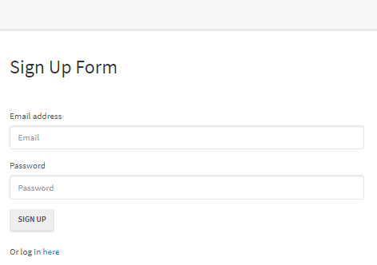
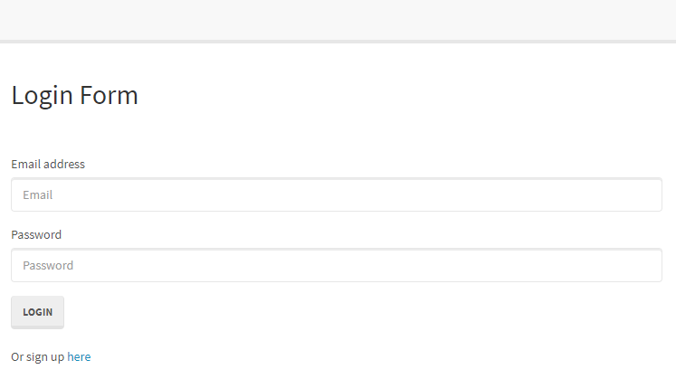
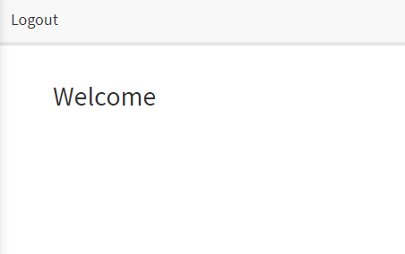

## Link to Google Doc Explanation
https://docs.google.com/document/d/1-BPfa26i5S8Rx_NiRN9PigVxFtYvANchQyrOvx_wd-8/edit

## User Story
As a Manager I want my Employees to be able to create accounts, so that I can control who has access to company content.

## Overview
This is a login application designed to let users securely create, log in, and out of an account with data stored in a MySQL database.

## Running the Application
1.  To begin please download this Repository and create a MySQL database called “passport_demo” by running the following schema:
-- Drops the todolist if it exists currently --
DROP DATABASE IF EXISTS passport_demo;
-- Creates the "passport_demo" database --
CREATE DATABASE passport_demo;

2.  Second, go into config/config.json and edit the “username” and “password” to your own, this file has been updated to contain “root” for both “username” and “password”.

3.  Third, is to open a terminal in the current repo and run “npm i” to install all node packages.

4.  Fourth, (after the npm installation has completed) run “node server” in the terminal to connect.

5.  Fifth, open your web browser and goto “http://localhost:8080” you should then see the home page pictured below:



## File Explanation
isAuthenticated.js - Restricts routes to a user not logged in, allows user access to routes if logged in, and if the user isn’t logged in will redirect them to the login page.


config.json - contains the information for connecting to the server.


passport.js - Requires the user to login with an email address, checks the email address within the database and if the password is correct or not.

index.js - Loads the config.json and is used to connect to the database and import user login data using sequelize.

user.js - Requires bcrypt and hashes the user’s password for protection before it is stored.

login.js - Validates that an email and password has been entered, this posts to the api/login to redirect the user to the members page.

members.js - Performs a request to check which user is logged in, then updates the page for the current logged in user.

signup.js - Checks that email and password are not blank, calls /api/signup then redirects to the members page.

styles.css - Adds a margin to the top of the page.

login.html - (pictured below) Uses a bootstrap stylesheet to present the user with an area to log in or sign up, which will then redirect them to the signup page.


members.html - (pictured below) This is the members page utilizing a bootstrap stylesheey for the user once they have successfully logged in and includes a Logout button that redirects the user to the login page.



signup.html - (pictured below) Is a sign up form for a user with an area for their email address, password, and buttons to either sign up which takes them to the member page, or log in here to redirect to the login page.


api-routes.js - Requires models and passport, this will check that the entered credentials are valid and send the user to the members page when logging in, sign up a new user and redirect them to the login page for their first login, and the ability for a user to log out then return them to the homepage.

html-routes.js - This routes the user according to their logged in status, thus if they are logged in are sent to the members page and if logged out are sent to the signup page.

package.json - Contains relevant metadata for the project, which gives information to the npm to identify and handle the projects dependencies.

server.js - Establishes our requirements to run the application and the port to which we are syncing.

## Potential Changes
Customizable positioning and color to add uniqueness for the business it’s being used for.


---


# Unit 14 Sequelize Homework: Reverse Engineering Code

Reverse engineer the starter code provided and create a tutorial for the code.

In the `Develop` folder, there is starter code for a project. Begin inspecting the code to get an understanding of each file's responsibility. Then, in a Google Doc, write a tutorial explaining *every* file and its purpose. If one file is dependant on other files, be sure to let the user know.

At the end of the tutorial, add instructions for how you could now add changes to this project.

Following the [common templates for user stories](https://en.wikipedia.org/wiki/User_story#Common_templates), we can frame this challenge as follows:

```
AS A developer

I WANT a walk-through of the codebase

SO THAT I can use it as a starting point for a new project
```

## Business Context

When joining a new team, you will be expected to inspect a lot of code that you have never seen before. Rather than having a team member explain every line for you, you will dissect the code by yourself, saving any questions for a member of your team.

## Acceptance Criteria

```md
GIVEN a Node.js application using Sequelize and Passport
WHEN I follow the walkthrough
THEN I understand the codebase
```
- - -

## Submission on BCS

You are required to submit the following:

* A link to a Google Doc or video explaining the application in `Develop/`. 

_Note: Don't forget to change the sharing settings on your Google Doc._

- - -
© 2019 Trilogy Education Services, a 2U, Inc. brand. All Rights Reserved.
